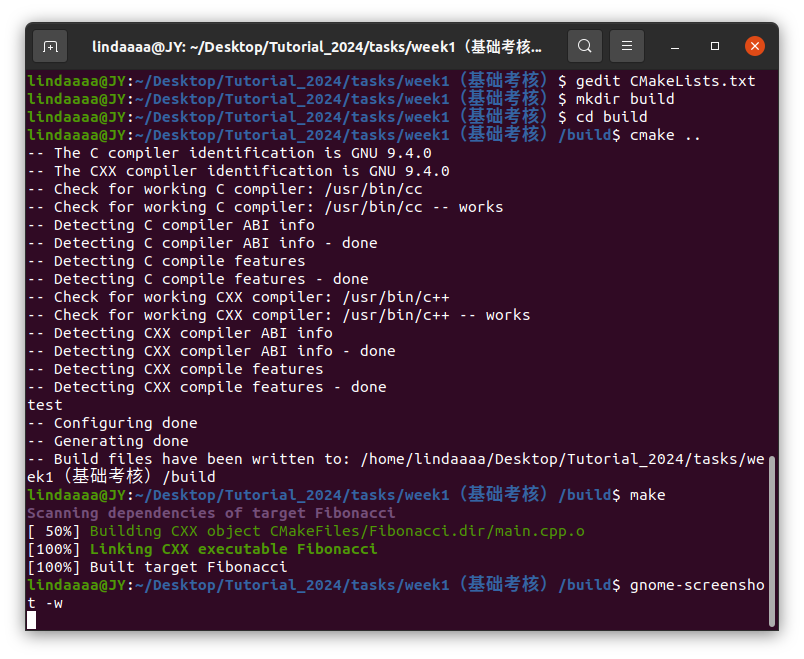
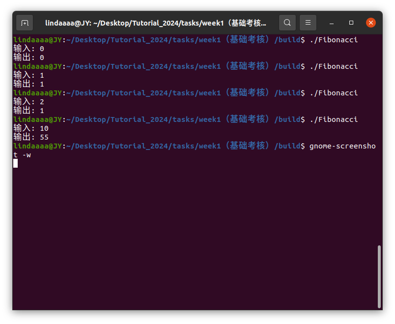
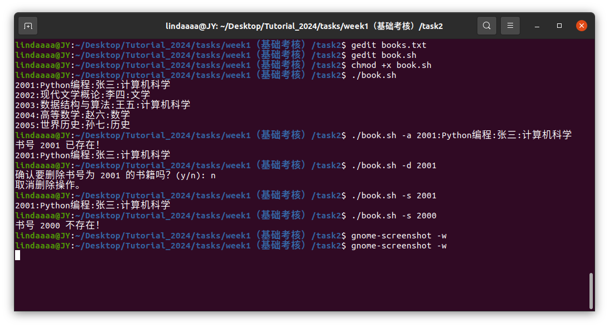
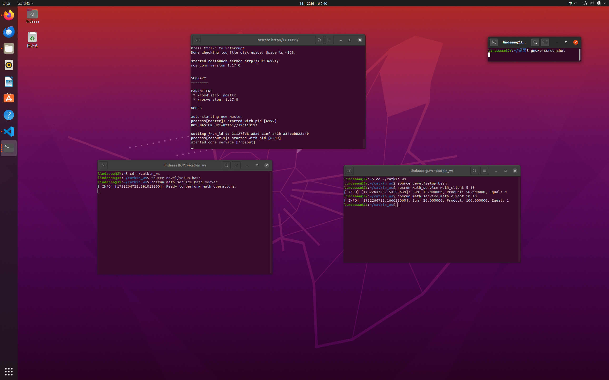

## TASK1报告
### 完成情况

任务一：完成。

任务二：完成。

任务三：完成。(只上传了ros包)

### 1. 斐波那契数列

#### 1.1题目
给定一个整数 `n`，计算并返回斐波那契数列的第 `n` 项。要求在 `Linux` 环境下使用任何文本编辑工具（vscode或者gedit均可）完成 C++ 代码的编写，然后用 `cmake` 和 `makefile` 编译这个 C++ 程序，不使用任何形式的IDE。

#### 1.2代码(main.cpp)
使用递归法完成。
```
#include<iostream>
using namespace std;

long Fi(long n){
    if(n==0) return 0;
    else if(n==1) return 1;
    else return Fi(n-1)+Fi(n-2);
}

int main(){
    cout<<"输入: ";
    long n;
    cin>>n;
    long result=Fi(n);
    cout<<"输出: "<<result<<endl;
}
```
#### 1.3编译步骤
```
cd ~/Desktop/Tutorial_2024/tasks/week1（基础考核）

gedit CMakeLists.txt
mkdir build
cd build

cmake ..
make

./Fibonacci
```

其中，CMakeList.txt的内容是
```
# 制定cmake最低版本
cmake_minimum_required(VERSION 3.10)

# 设置工程名称
project(MyCppProject)

message("test")

# 指定语言版本
set(CMAKE_CXX_STANDARD 11)
# 创建可执行文件
add_executable(Fibonacci main.cpp)
```

#### 1.4测试
测试结果如下图。





### 2. Linux Shell
#### 1.1题目
设计一个脚本，名称为 `book.sh`，该脚本实现以下功能：

+ 当输入 `book.sh` 时，列出文件中所有书籍的记录内容。
+ 当输入 `book.sh -a 2001:Python编程:张三:计算机科学` 时，首先判断 `2001` 书号记录是否存在，如果不存在，则将该信息写入文件；如果存在，则给出提示，并输出文件中书号为 `2001` 的该行信息。
+ 当输入 `book.sh -d 2001` 时，首先判断 `2001` 书号记录是否存在，如果不存在，则给出提示；如果存在，则提示用户确认是否要删除记录。若用户输入 `y` 或 `yes`，则删除文件中书号为 `2001` 的该行信息；若用户输入 `n` 或 `no`，则不做删除操作。
+ 当输入 `book.sh -s 2001` 时，首先判断 `2001` 书号记录是否存在，如果不存在，给出提示；如果存在，则输出文件中书号为 `2001` 的该行信息。
当用户输入的选项不正确时，给出错误提示，并显示脚本的使用方法。

要求使用 `if` 判断语句来检测不同的参数，且脚本必须能够正确处理用户输入的错误参数并给出提示。

#### 1.2代码(book.sh)
```
#!/bin/bash

## $0 是脚本的名称，$# 是传入的参数数量，$1 是第一个参数，$BOOK_ID 是变量BOOK_ID的内容

## 定义书籍文件路径
BOOK_FILE="books.txt"

# 检查文件是否存在，如果不存在则用touch创建一个空文件
if [ ! -f "$BOOK_FILE" ]; then
    touch "$BOOK_FILE"
fi

## 使用方法，在用户输入参数错误时显示
usage() {
    echo "Usage: $0 [-a book_info] [-d book_id] [-s book_id]"
    echo "  -a  添加新书籍，格式: 书号:书名:作者:类别"
    echo "  -d  删除书籍，需要提供书号"
    echo "  -s  搜索书籍，需要提供书号"
    echo "  无参数  显示所有书籍"
}

## 没有参数
if [ $# -eq 0 ]; then
    cat "$BOOK_FILE"
else
    case $1 in
        -a)
            ## -a添加书籍
            BOOK_INFO=$2
            BOOK_ID=$(echo $BOOK_INFO | cut -d':' -f1)
            if grep -q "^$BOOK_ID:" "$BOOK_FILE"; then
                echo "书号 $BOOK_ID 已存在！"
                grep "^$BOOK_ID:" "$BOOK_FILE"
            else
                echo "$BOOK_INFO" >> "$BOOK_FILE"
                echo "书籍已添加：$BOOK_INFO"
            fi
            ;;
        -d)
            ## -d删除书籍
            BOOK_ID=$2
            if grep -q "^$BOOK_ID:" "$BOOK_FILE"; then
                read -p "确认要删除书号为 $BOOK_ID 的书籍吗？(y/n): " CONFIRM
                if [[ "$CONFIRM" =~ ^[Yy]$ ]]; then
                    sed -i "/^$BOOK_ID:/d" "$BOOK_FILE"
                    echo "书籍已删除：书号 $BOOK_ID"
                else
                    echo "取消删除操作。"
                fi
            else
                echo "书号 $BOOK_ID 不存在！"
            fi
            ;;
        -s)
            ## -s搜索书籍
            BOOK_ID=$2
            if grep -q "^$BOOK_ID:" "$BOOK_FILE"; then
                grep "^$BOOK_ID:" "$BOOK_FILE"
            else
                echo "书号 $BOOK_ID 不存在！"
            fi
            ;;
        *)
            ## 其他：错误参数
            usage
            ;;
    esac
fi
```

#### 1.3测试
测试结果如下图。



### 3. ROS通信机制

### 3.1 简单话题通信和自定义消息
编写一个 package，其中包含一个信息发布节点 `Publisher`，和一个信息订阅节点 `Subscriber`。信息发布节点产生随机数据并发布，要求使用自己创建的自定义消息类型，信息订阅节点订阅话题并将数据输出到终端。

#### 3.1.1 创建ROS工作空间&配置功能包

创建ROS工作空间。

```
mkdir -p ~/catkin_ws/src
cd ~/catkin_ws/
catkin_make
source devel/setup.bash
```

创建包。

进入src目录，使用catkin_create_pkg命令创建一个新的ROS包，命名为`random_data_pubsub`

```
cd ~/catkin_ws/src
catkin_create_pkg random_data_pubsub rospy roscpp std_msgs message_generation
```
创建消息文件夹和文件。

在random_data_pubsub包目录下创建一个msg`文件夹，用于存放自定义的消息文件。
```
cd ~/catkin_ws/src/random_data_pubsub
mkdir msg
```
在msg文件夹内创建一个RandomData.msg。文件内容定义了自定义消息格式。发送一个浮点数和一个字符串。

   ```
   float64 data
   string message
   ```

修改CMakeLists.txt。
```
cmake_minimum_required(VERSION 3.0.2)
project(random_data_pubsub)

find_package(catkin REQUIRED COMPONENTS
  message_generation
  roscpp
  rospy
  std_msgs
)
add_message_files(
  FILES
  RandomData.msg
)

generate_messages(
  DEPENDENCIES
  std_msgs
)

catkin_package(
  CATKIN_DEPENDS rospy std_msgs message_runtime
)

add_executable(publisher_node src/publisher.cpp)
target_link_libraries(publisher_node ${catkin_LIBRARIES})

add_executable(subscriber_node src/subscriber.cpp)
target_link_libraries(subscriber_node ${catkin_LIBRARIES})
```
修改package.xml。增加message_runtime的依赖。

```
<exec_depend>message_runtime</exec_depend>
```

编译包。

```
cd ~/catkin_ws
catkin_make
source devel/setup.bash
```
#### 3.1.2 写publisher节点和subscriber节点
在`random_data_pubsub`包的`src`目录下创建一个`publisher.cpp`。

```
#include "ros/ros.h"
#include "random_data_pubsub/RandomData.h"

int main(int argc, char **argv) {
  ros::init(argc, argv, "publisher_node");
  ros::NodeHandle n;

  ros::Publisher pub = n.advertise<random_data_pubsub::RandomData>("random_data_topic", 1000);

  ros::Rate loop_rate(10); // 10Hz

  while (ros::ok()) {
    random_data_pubsub::RandomData msg;
    msg.data = rand() % 100; // 生成0-99之间的随机整数
    msg.message = "Random Data";

    ROS_INFO("Publishing: %f, %s", msg.data, msg.message.c_str());

    pub.publish(msg);

    ros::spinOnce();
    loop_rate.sleep();
  }

  return 0;
}
```
在`random_data_pubsub`包的`src`目录下创建一个`subscriber.cpp`。
```
#include "ros/ros.h"
#include "random_data_pubsub/RandomData.h"

void chatterCallback(const random_data_pubsub::RandomData::ConstPtr& msg) {
  ROS_INFO("I heard: [%.2f, %s]", msg->data, msg->message.c_str());
}

int main(int argc, char **argv) {
  ros::init(argc, argv, "subscriber_node");
  ros::NodeHandle n;

  ros::Subscriber sub = n.subscribe("random_data_topic", 1000, chatterCallback);

  ros::spin();

  return 0;
}
```

#### 3.1.3 测试结果

先启动ROS核心

```
roscore
```

在新的终端窗口中运行publisher节点：

```
rosrun random_data_pubsub publisher_node
```

在另一个新的终端窗口中运行subscriber节点：

```
rosrun random_data_pubsub subscriber_node
```

左侧运行发布者节点

右侧运行订阅者节点

- ps.在打开新的终端时要重新source一下```source ~/catkin_ws/devel/setup.bash```,然后使用```rospack find random_data_pubsub```命令可以确认包是否能够找到。


### 3.2 简单服务通信
编写一个 package，其中包含一个服务端`Service`和一个客户端`client`。客户端向服务端发送两个数字，服务端接收这两个数字并返回它们的和、乘积、是否相等(True or False)

#### 3.2.1 创建工作空间、新的ROS包
新的ROS包`math_service`依赖于`roscpp`和`std_msgs`

```bash
cd ~/catkin_ws/
catkin_make
source devel/setup.bash
cd ~/catkin_ws/src
catkin_create_pkg math_service roscpp std_msgs
```

#### 3.2.2 编写服务接口、服务端和客户端

在`math_service`包的srv路径下，创建一个服务文件`MathOps.srv`来自定义服务接口。

发送两个float64的数，返回两个float64数和一个bool数。
```
float64 a
float64 b
---
float64 sum
float64 product
bool equal
```
在`math_service/src/server.cpp`里实现服务端。
```
#include "ros/ros.h"
#include "math_service/MathOps.h"

//计算函数
bool handle_math_ops(math_service::MathOps::Request &req,
                     math_service::MathOps::Response &res)
{
  res.sum = req.a + req.b;
  res.product = req.a * req.b;
  res.equal = (req.a == req.b);
  return true;
}

int main(int argc, char **argv)
{
  ros::init(argc, argv, "math_server");
  ros::NodeHandle n;

//初始化服务端
  ros::ServiceServer service = n.advertiseService("math_ops", handle_math_ops);
  ROS_INFO("Ready to perform math operations.");
//进入ROS的主循环，等待并处理服务请求
  ros::spin();

  return 0;
}
```
在`math_service/src/client.cpp`里实现客户端。

```
#include "ros/ros.h"
#include "math_service/MathOps.h"

int main(int argc, char **argv)
{
  ros::init(argc, argv, "math_client");

  // 检查命令行参数
  if (argc != 3)
  {
    ROS_INFO("usage: math_client X Y");
    return 1;
  }

  ros::NodeHandle n;
  // 创建服务客户端
  ros::ServiceClient client = n.serviceClient<math_service::MathOps>("math_ops");
 
  //创建一个服务请求对象，从命令行参数中读取两个整数赋值
  math_service::MathOps srv;
  srv.request.a = atoll(argv[1]);
  srv.request.b = atoll(argv[2]);

  //调用服务，打印结果
  if (client.call(srv))
  {
    ROS_INFO("Sum: %f, Product: %f, Equal: %d", (double)srv.response.sum, (double)srv.response.product, (int)srv.response.equal);
  }
  else
  {
    ROS_ERROR("Failed to call service math_ops");
    return 1;
  }
  

  return 0;
}
```

#### 接着修改依赖。
`CMakeLists.txt`文件里面要加上`message_generation`包、服务接口、服务端和客户端的可执行文件等。

`package.xml`文件里面要加上`message_generation`的依赖。

最终的`CMakeList.txt`:

```
cmake_minimum_required(VERSION 3.0.2)
project(math_service)

find_package(catkin REQUIRED COMPONENTS
  roscpp
  std_msgs
  message_generation
)

add_service_files(
  FILES
  MathOps.srv
)

generate_messages(
  DEPENDENCIES
  std_msgs
)

catkin_package(
  CATKIN_DEPENDS roscpp std_msgs message_runtime
)

add_executable(math_server src/server.cpp)
target_link_libraries(math_server ${catkin_LIBRARIES})

add_executable(math_client src/client.cpp)
target_link_libraries(math_client ${catkin_LIBRARIES})
```
最终的`package.xml`补充了三行。
```
  <build_depend>message_runtime</build_depend>
  <build_export_depend>message_runtime</build_export_depend>
  <exec_depend>message_runtime</exec_depend>
```
然后重新编译工作空间。
```bash
cd ~/catkin_ws
catkin_make
source devel/setup.bash
```

#### 3.1.4 测试结果
先运行roscore

左侧运行服务端节点rosrun math_service math_server

右侧运行客户端rosrun math_service math_client 10 5 

